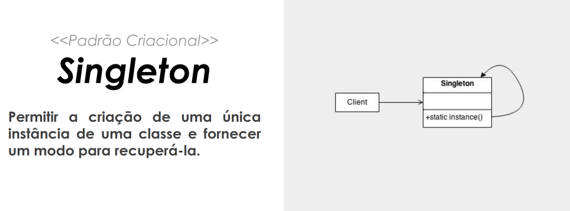
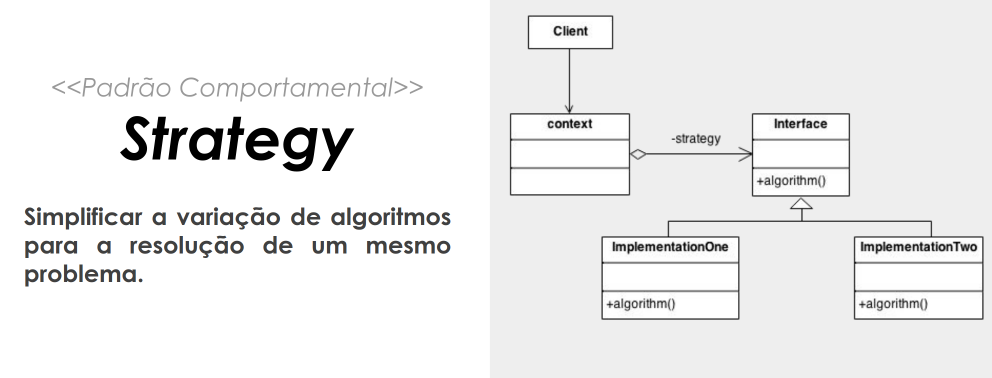
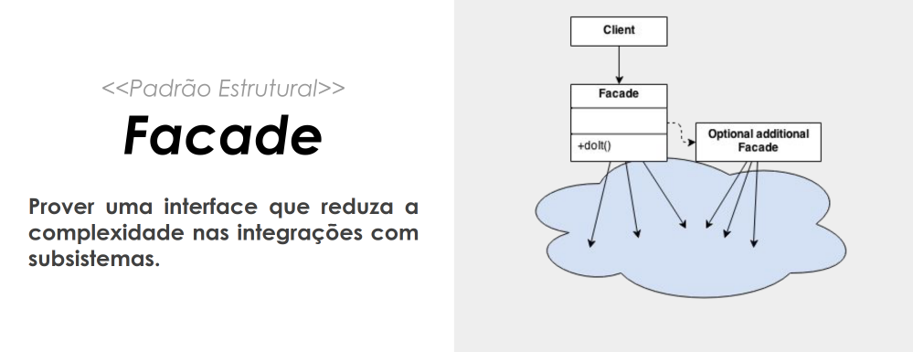

# Desafio DIO explorando Padrões de Projetos na Prática com Java

 

 

Repositório com as implementações dos padrões de projeto explorados no Lab "Explorando Padrões de Projetos na Prática com Java". Especificamente, este projeto explorou alguns padrões usando o Spring Framework, são eles:

 

 

 

